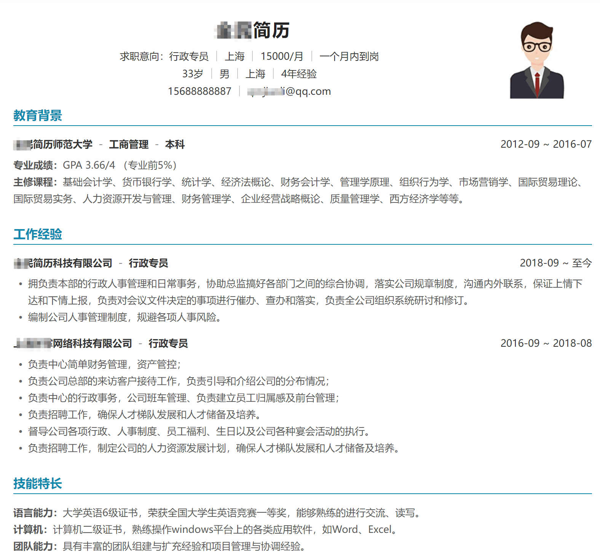
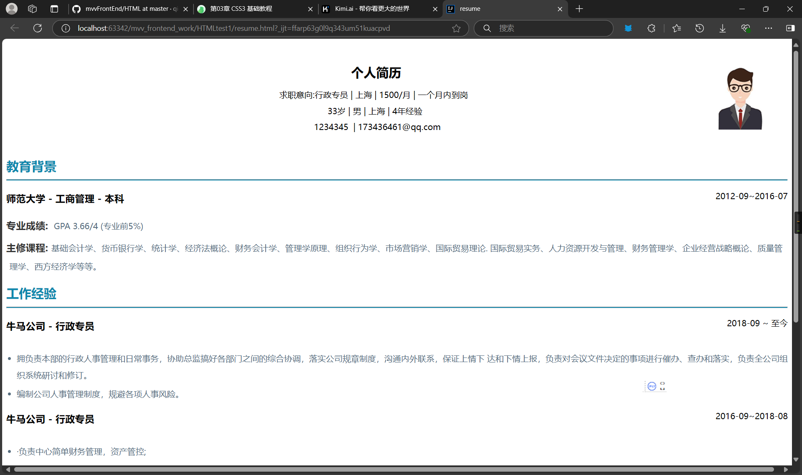

# 作业
## 要求：

● 用HTML+CSS 实现下面的简历 (尽可能1:1还原)
● 代码上传到github或gitee上的MVVM前端项目仓库中

提示：用flex布局处理居中，居右更容易

ok,然后使用大一的webUI知识进行编写代码

代码在同目录下的文件里（包含css代码及html代码）

这里采用的是外联式，详细内容不说了（就是先用颜色划区域，然后步步调内边距和外边距的过程）

看效果

OK，看上去不错，完成。