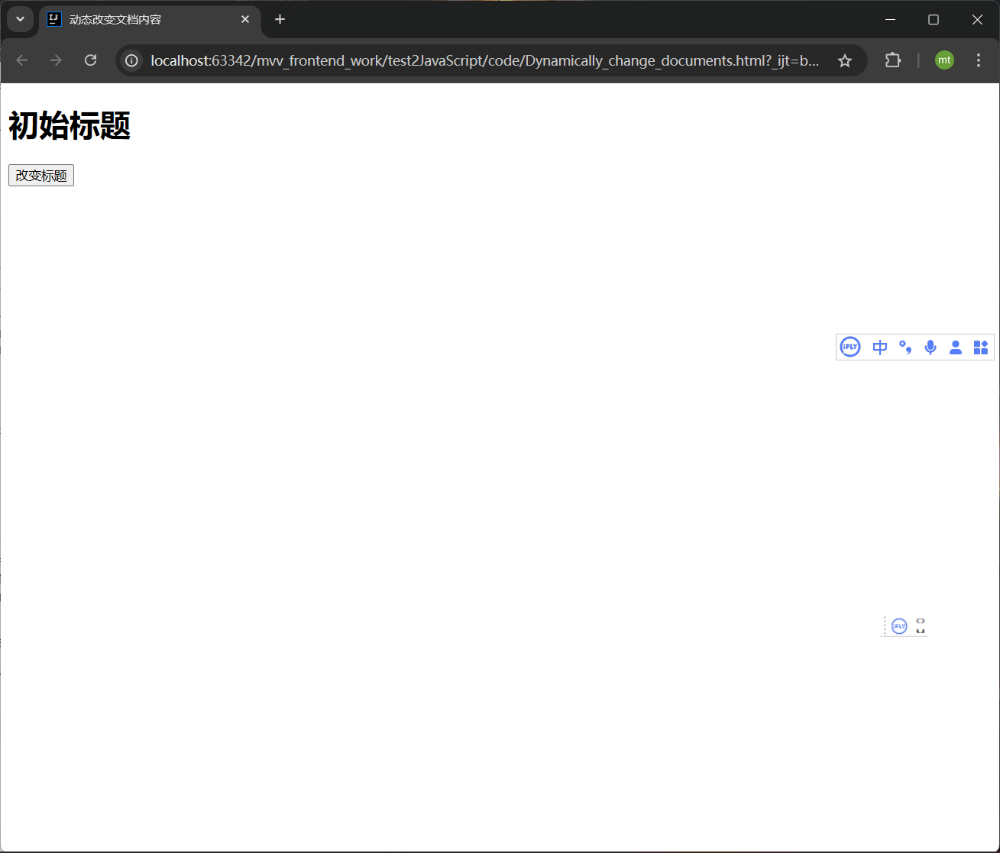
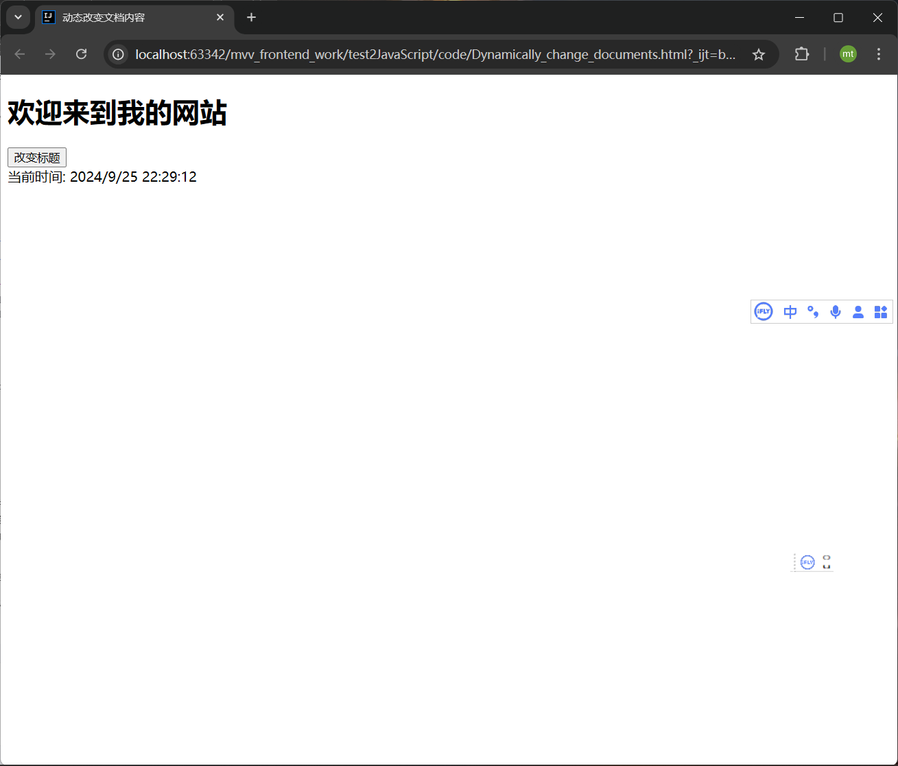
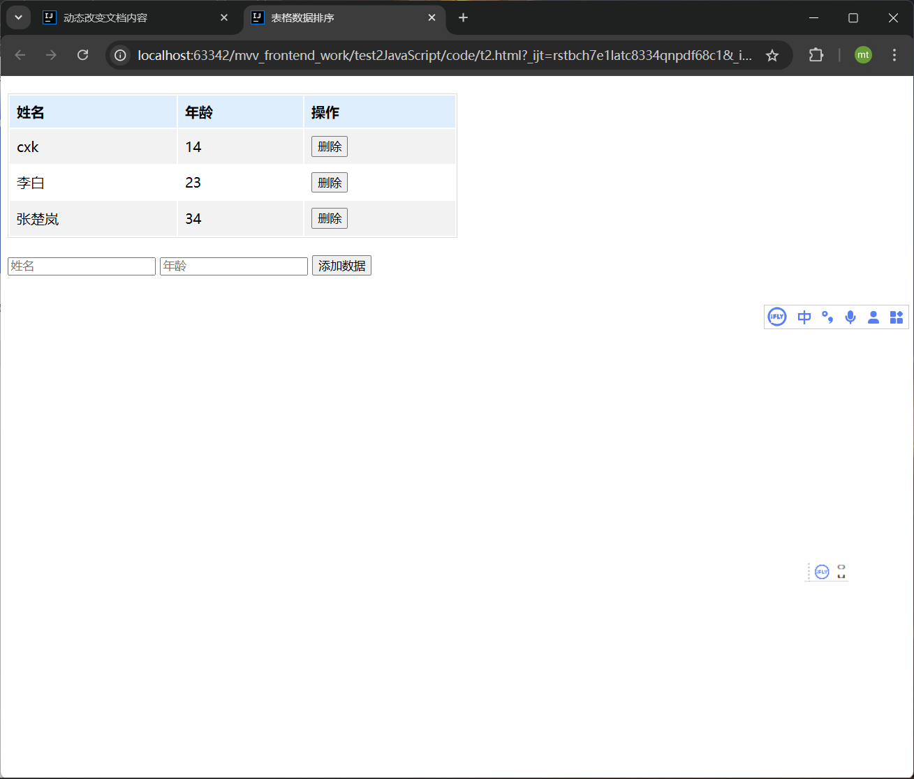
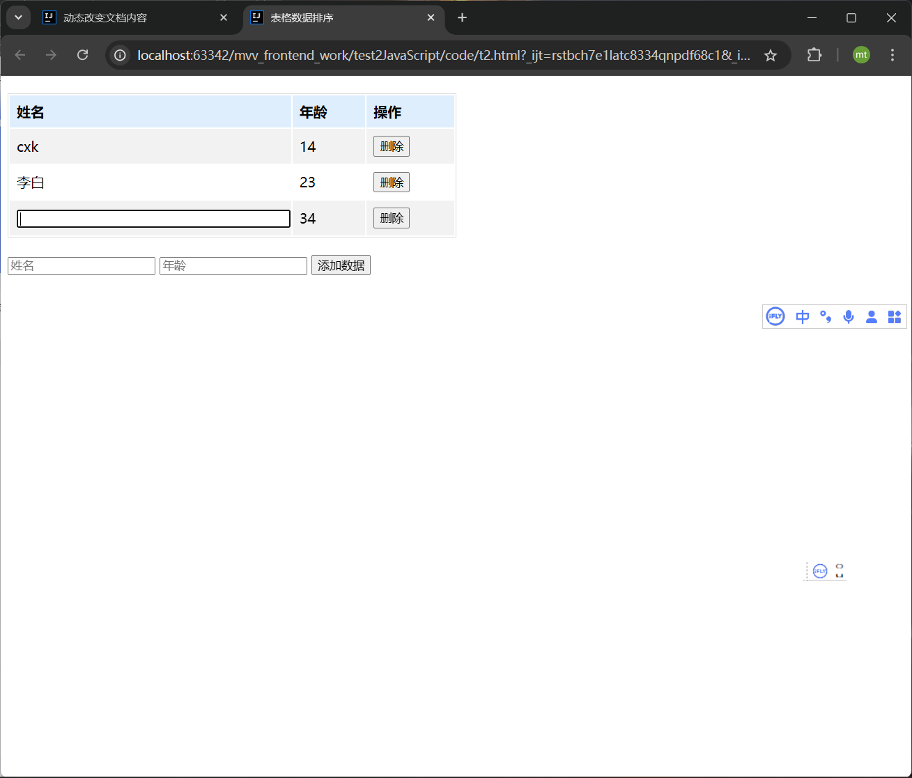
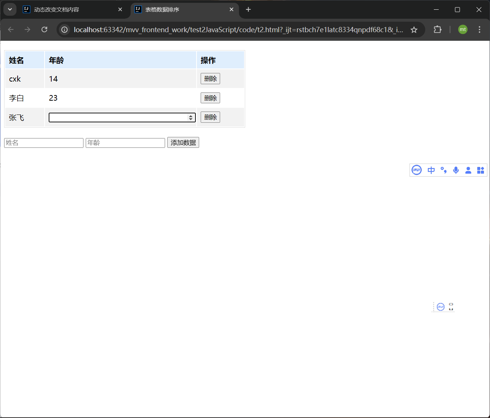
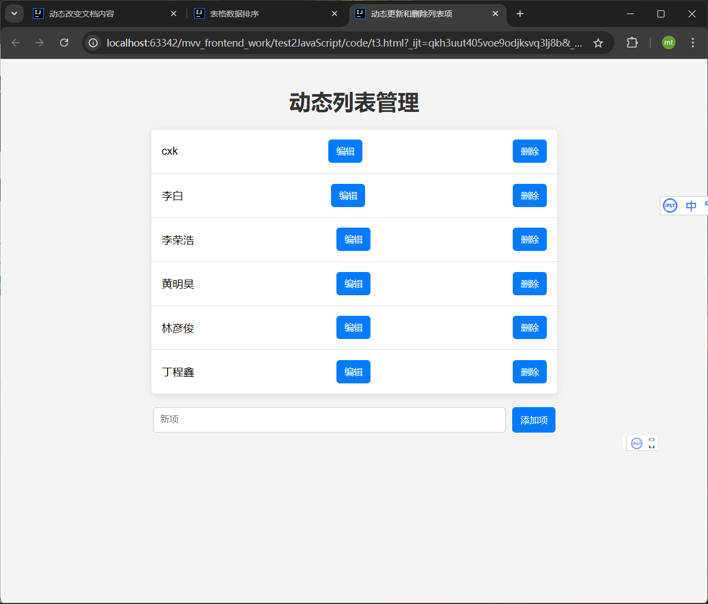
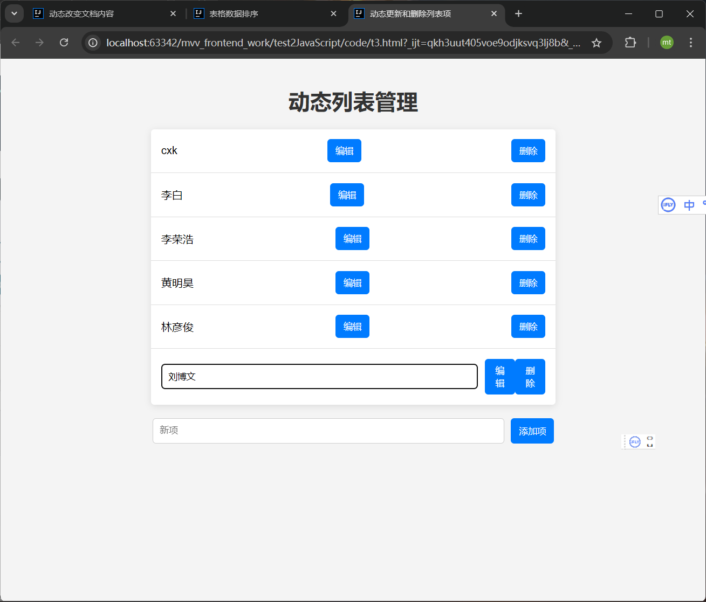
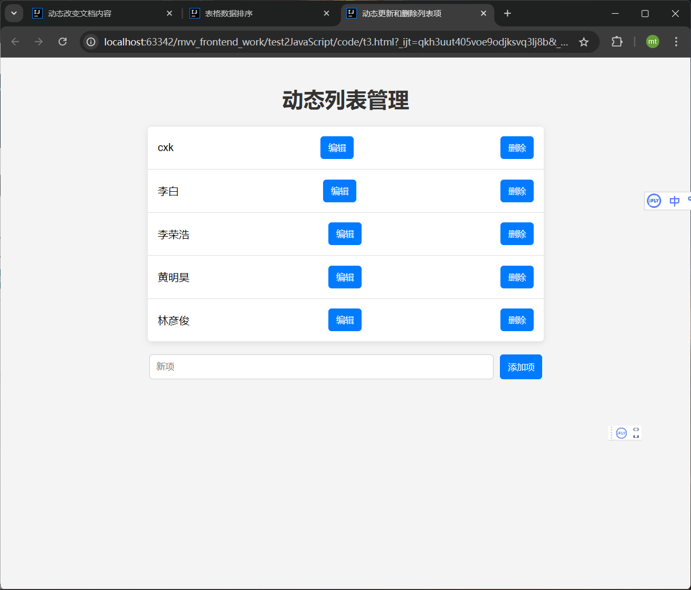

学院：省级示范性软件学院

题目：《 作业2：js练习》

姓名：焦买涛

学号：2200770114

班级：软工2203

日期：2024-09-25

*** 
# js练习

## 1. 动态改变文档内容

要求：创建一个按钮，点击后将文档的` <h1> `元素内容改为 "欢迎来到我的网站"，并在页面底部显示当前时间。

[代码跳转 ](code/Dynamically_change_documents.html)

运行截图

运行后

## 2.表格操作

要求：
1. 创建一个表格，允许用户输入数据（姓名和年龄），添加到表格中，并在添加后按年龄升序排列。

2. 在表格中添加删除按钮，点击后删除当前行，并在删除后更新表格的行号。

3. 额外（）

[代码跳转](code/t2.html)

运行截图

删除

修改姓名

修改年纪

成功

## 3. 列表操作

   要求：创建一个无序列表，允许用户输入新项并添加到列表中。每个列表项旁边有一个编辑按钮，点击后可以修改该项的内容，还有一个删除按钮，点击后可以删除该项。

[代码跳转](code/t3.html)

添加数据

编辑数据

删除数据

OK  完成

注：

以上说法以及内容仅用于本人学习和成长，如有侵权联系删除，如有错误请见谅，欢迎讨论。

