学院：省级示范性软件学院

题目：《 作业4： vue3+springboot》

姓名：焦买涛

学号：2200770114

班级：软工2203

日期：2024-11-25

***

要求：

1. 使用前端模板完成CRUD的练习，要能够CRUD到后端的真实数据

2. 对接后端的接口服务，可以是学生表，老师表，或员工表

3. 提交代码和截图

* 截止日期：12-01 23:59

***

## 一、后端实现

### 1. MySQL内容

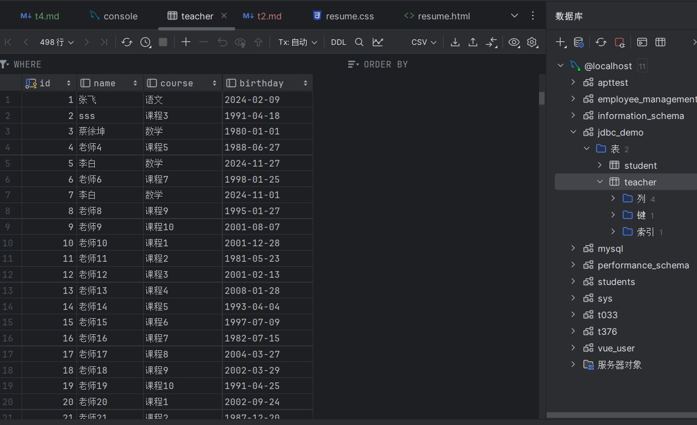

这个是教师表

### 2. springboot内容

#### 2.1 项目结构

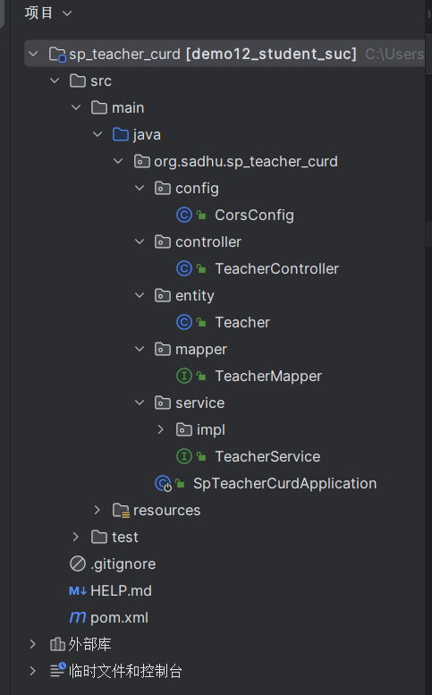

运行结果

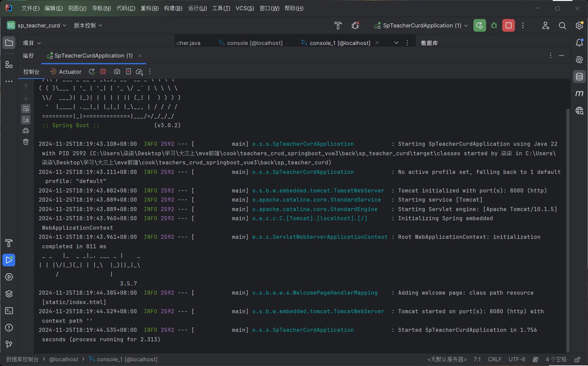

具体代码在/code/teachers_crud_springboot_vue3/back中

## 前端实现

### 一、 vue3项目结构

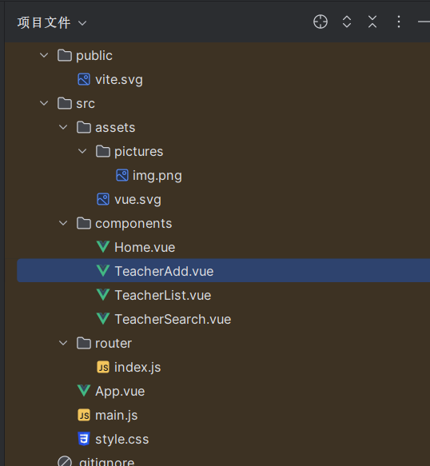

具体代码在/code/teachers_crud_springboot_vue3/fount

运行结果
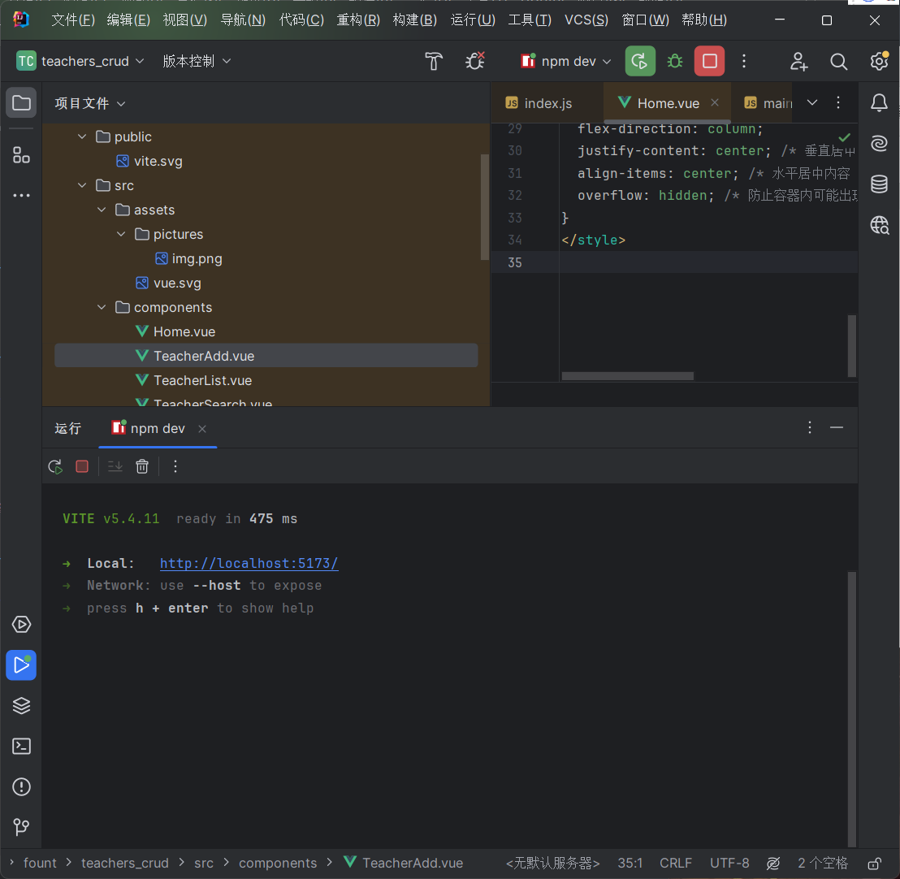

访问  http://localhost:5173/

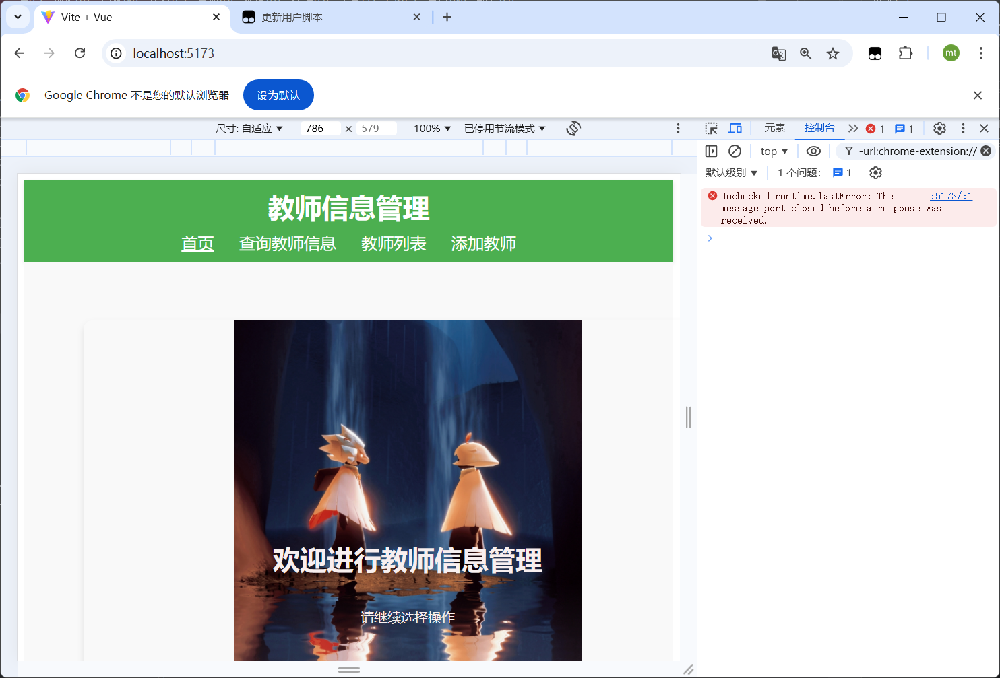

查看教师

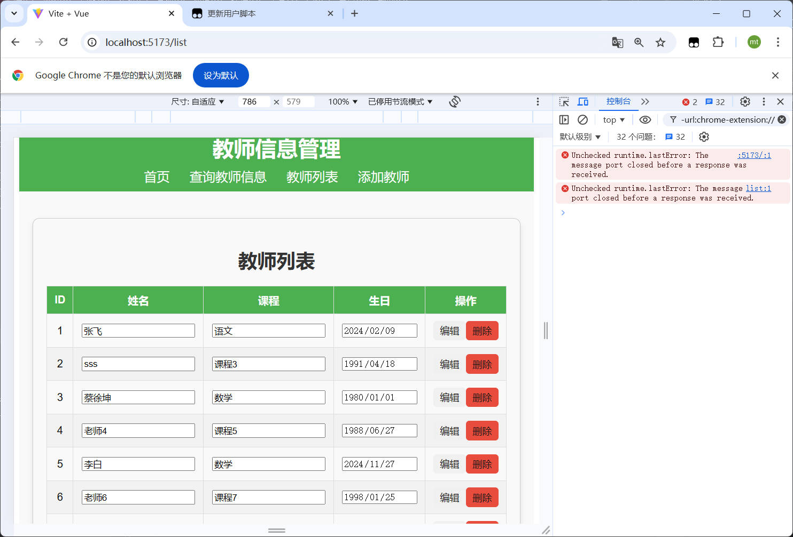

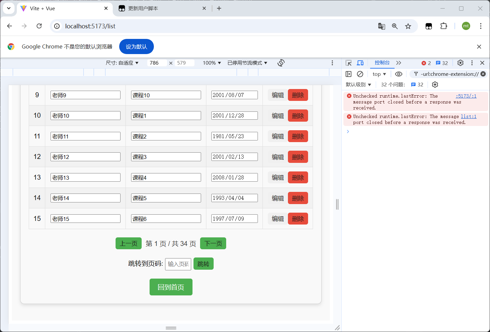

查询教师

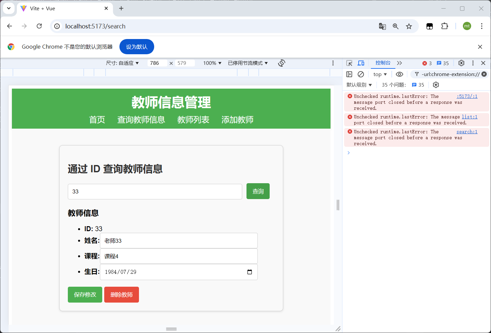

修改信息

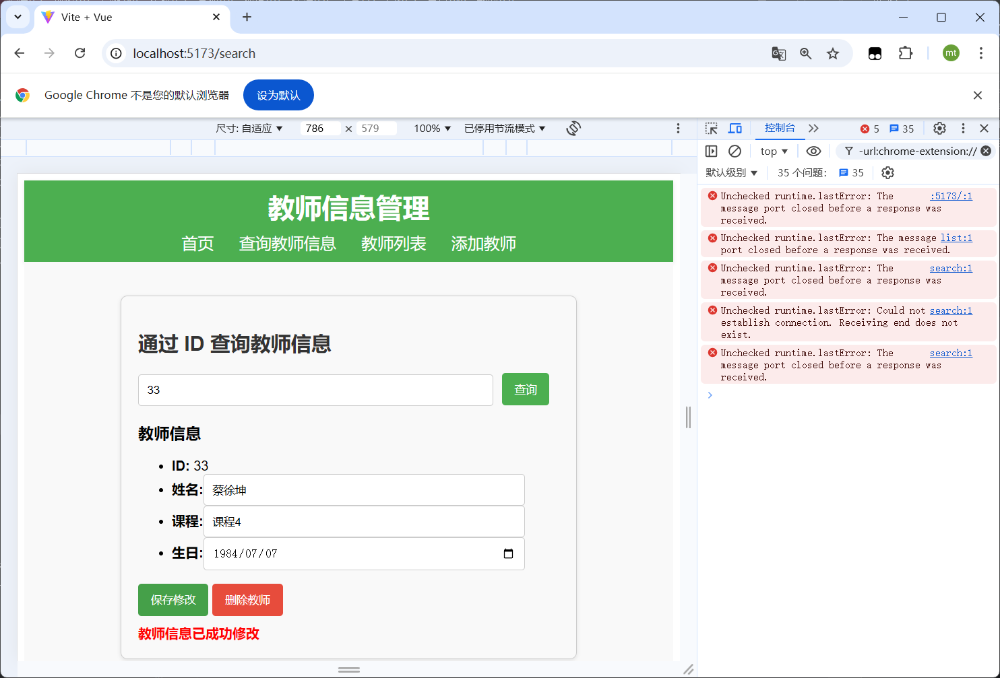

再查询，以及看数据库内容
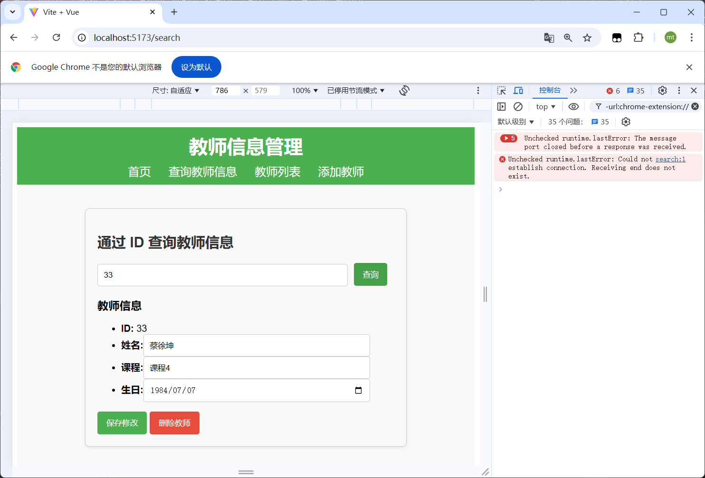

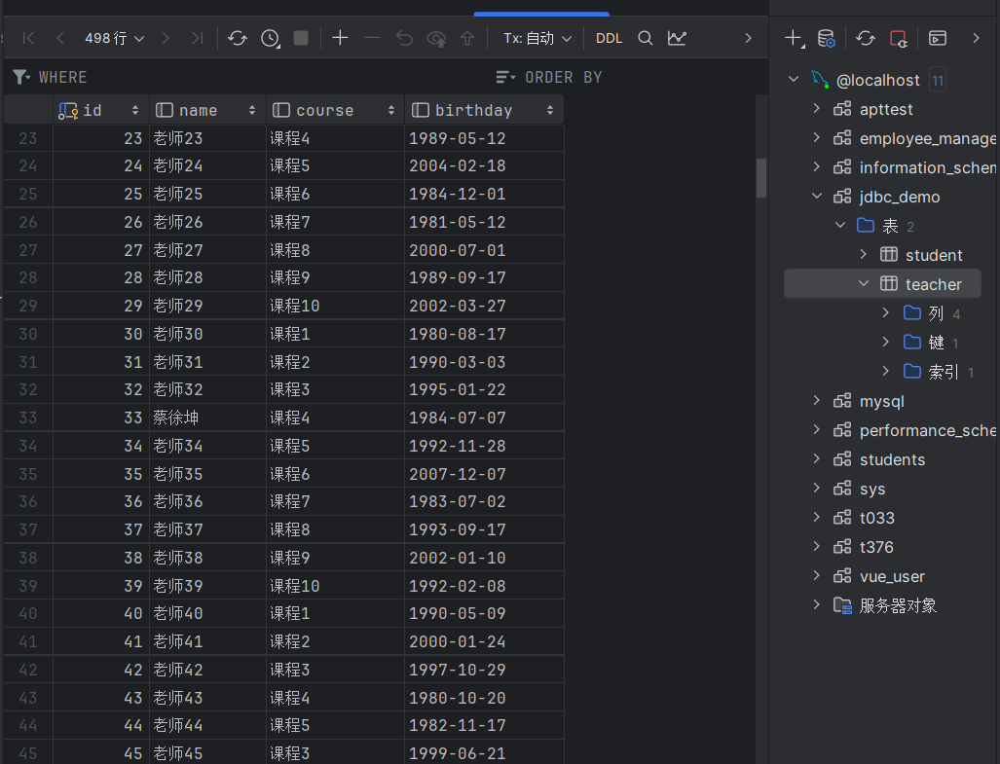

修改成功

增加信息

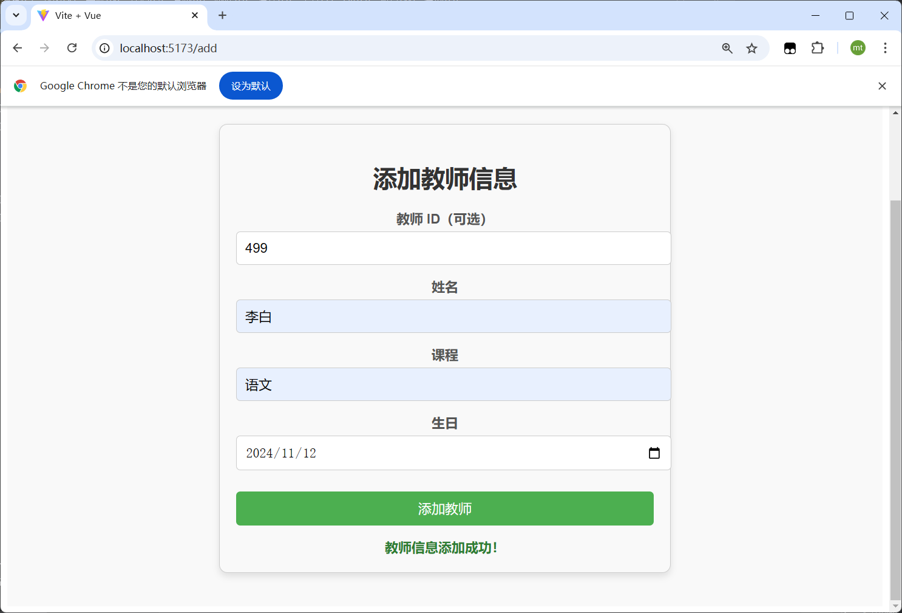
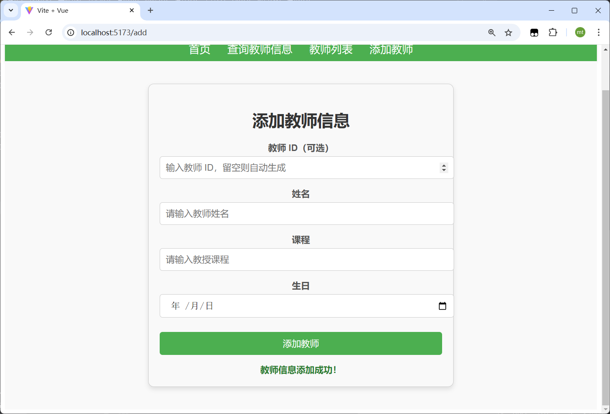

显然再查看数据库

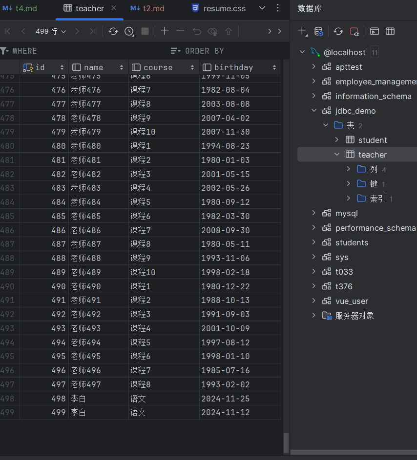

显然成功

所以增删改查实现。。。

